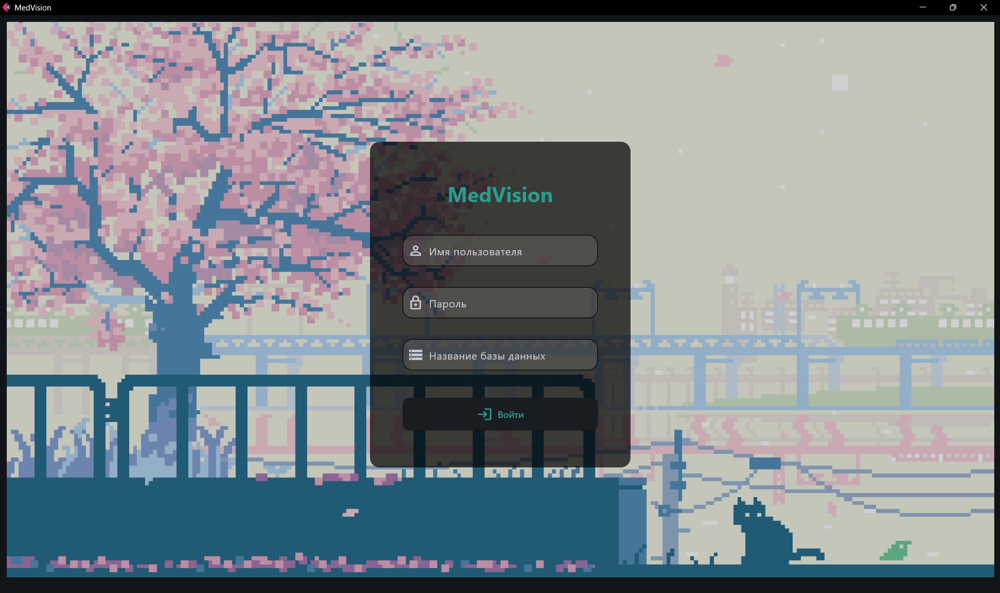
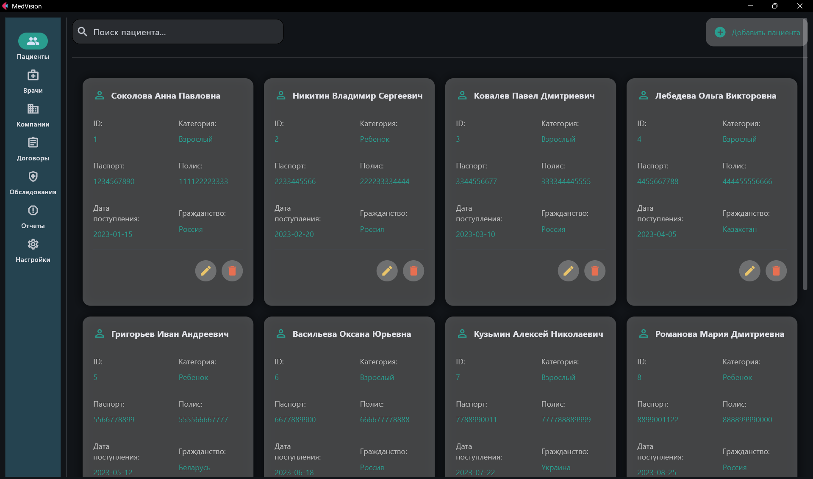
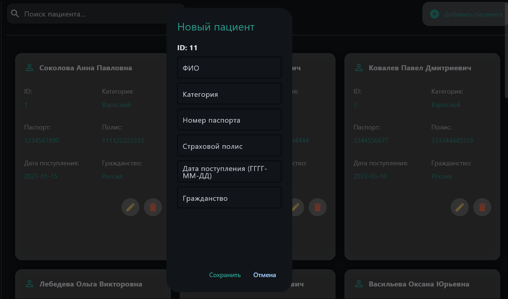
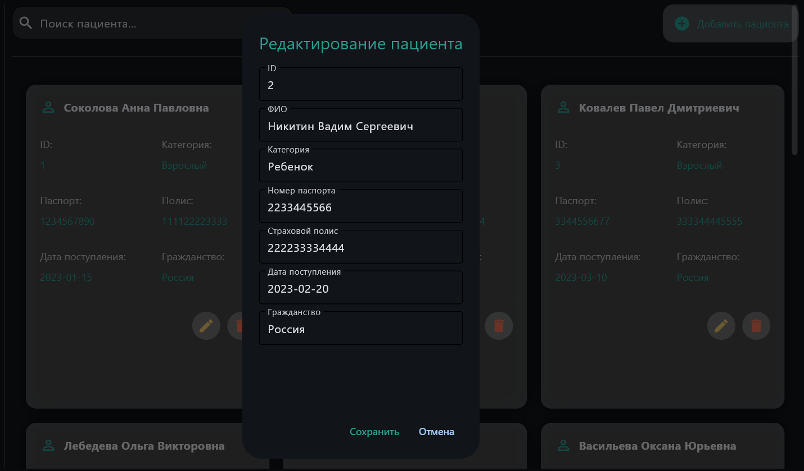
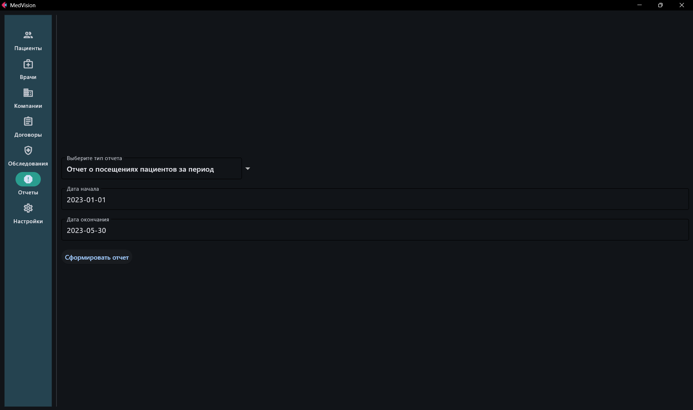
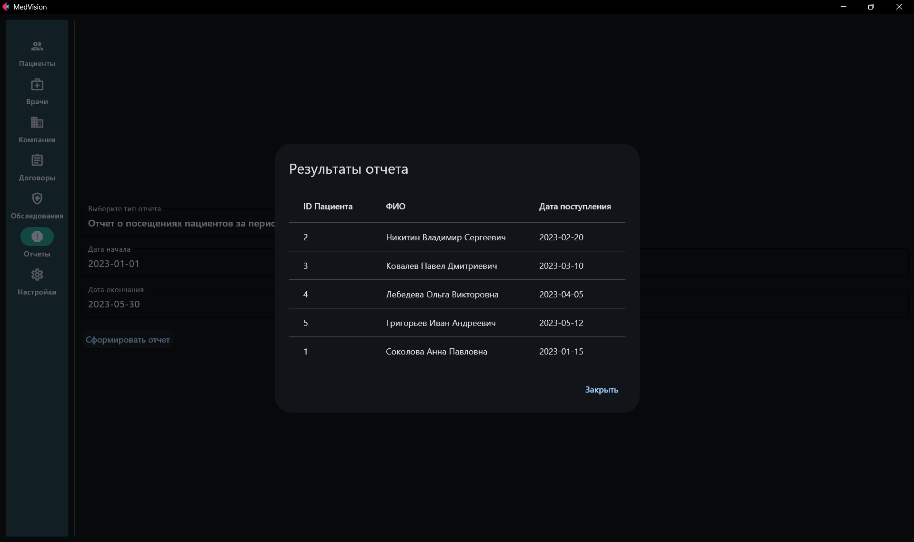
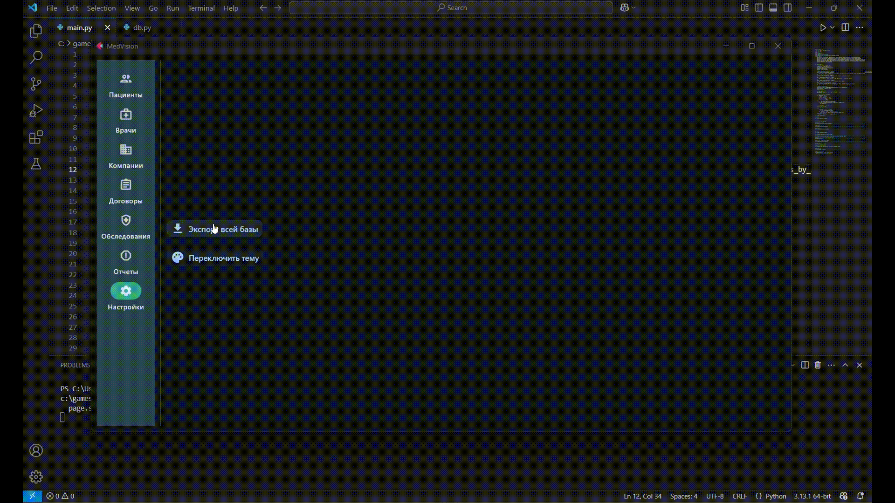

# MedVision - Медицинская информационная система

MedVision - это макет приложения для управления медицинской базой данных, точнее отдела договоров. Приложение позволяет управлять информацией о пациентах, врачах, страховых компаниях, договорах и обследованиях.

## 🌟 Особенности

- **CRUD-операции** для всех сущностей
- **5 типов отчетов**
- Экспорт данных в **Excel**
- Темная/светлая темы
- Поиск по всем полям
- Валидация данных
- Авторизация с настройкой БД

## 🛠 Технологии

- `Python 3.10+`
- `Flet` (GUI)
- `PostgreSQL` (база данных)
- `Pandas` (экспорт в Excel)
- `psycopg2` (работа с PostgreSQL)

## 🖼 Скриншоты интерфейса

### Авторизация

### Таблицы пациенты

### Добавление на примере пациентов

### Редактирование на примере пациентов

### Остальные таблицы сделаны так же, но соответственно с другими данными

### Вкладка отчеты

### Пример отображения отчета

### Настройки

### Экспорт в Excel

